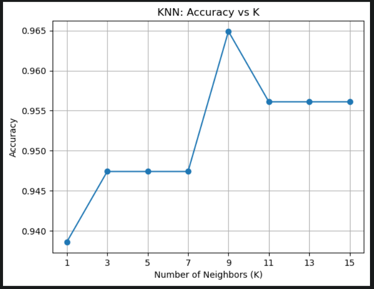

# 🩺 Breast Cancer Classification using K-Nearest Neighbors (KNN)

A Machine Learning project that classifies breast cancer tumors as **Malignant** or **Benign** using the **K-Nearest Neighbors (KNN)** algorithm.

---

## 📌 Project Overview

This project demonstrates the complete machine learning workflow for a classification problem using the Breast Cancer Wisconsin dataset available in **Scikit-learn**.

The model is trained using the KNN algorithm, and different values of **K** are tested to determine the optimal number of neighbors.

---

## 📂 Dataset

- **Source:** `sklearn.datasets.load_breast_cancer()`
- **Samples:** 569
- **Features:** 30
- **Target Classes:**
  - **0 → Malignant**
  - **1 → Benign**

---

## 🚀 Technologies Used

- Python
- NumPy
- Pandas
- Matplotlib
- Scikit-learn

---

## 🛠️ Machine Learning Workflow

- Import Libraries
- Load Dataset
- Data Exploration
- Train-Test Split
- Feature Scaling using StandardScaler
- Train KNN Classifier
- Model Prediction
- Accuracy Evaluation
- Confusion Matrix
- Classification Report
- Hyperparameter Tuning (Finding the Best K)

---

## 📊 Model Performance

### Overall Accuracy

- **Accuracy:** **95%**

### Best Hyperparameter

- **Best K:** **9**
- **Best Accuracy:** **96.49%**

### Classification Report

| Metric | Malignant | Benign |
|---------|----------:|--------:|
| Precision | 0.93 | 0.96 |
| Recall | 0.93 | 0.96 |
| F1-Score | 0.93 | 0.96 |

---

## 📈 Accuracy vs Number of Neighbors (K)

The following graph compares the model accuracy for different values of **K**.

From the graph, **K = 9** achieved the highest accuracy (**96.49%**), making it the optimal choice for this dataset.

---

## 📚 Concepts Covered

- Supervised Machine Learning
- Classification
- K-Nearest Neighbors (KNN)
- Feature Scaling
- Euclidean Distance
- Hyperparameter Tuning
- Model Evaluation

---
